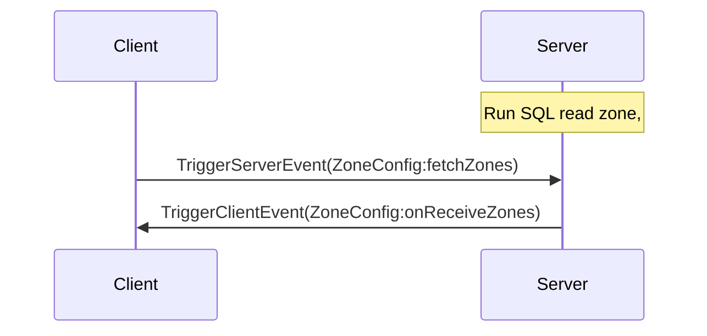

## Get zones

```mermaid
sequenceDiagram
  participant Client
  participant Server

  Note over Server: Run SQL read zone,
  Client ->> Server: TriggerServerEvent(ZoneConfig:fetchZones)
  Server ->> Client: TriggerClientEvent(ZoneConfig:onReceiveZones)

```